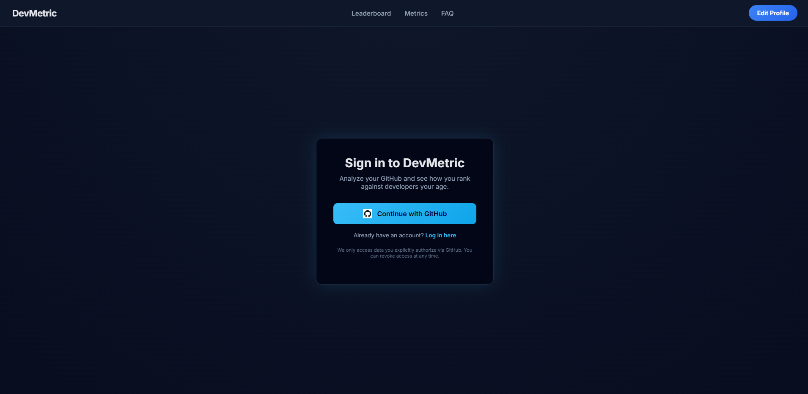
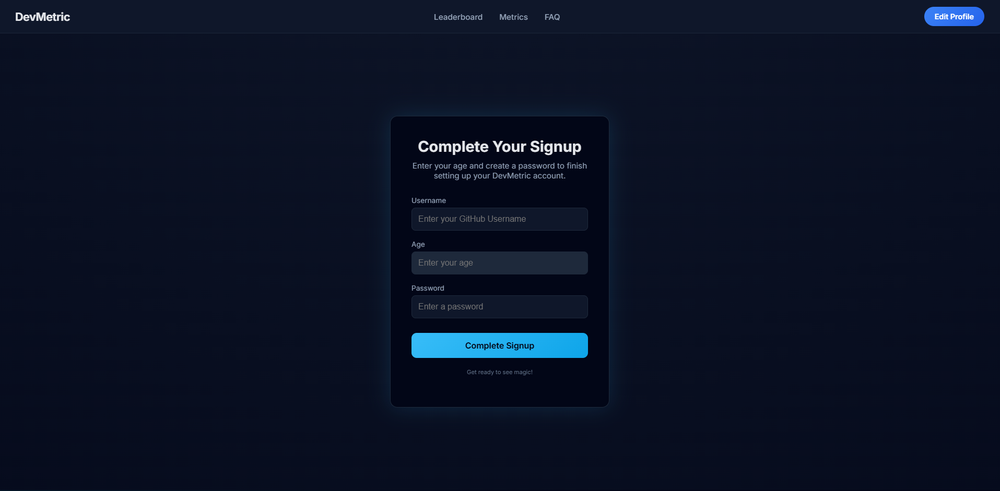

# DevMetric

## GitHub AI Checker is an AI-powered tool that benchmarks your GitHub activity against peers and provides insights on your coding progress, languages, and skill growth over time.

### Features

Analyze GitHub contributions: commits, repos, stars, forks

Percentile ranking against peers by age or experience

Language and tech stack insights

Optional skill analysis with ML/NLP on commit messages and README files

Dashboard visualizations for contributions and trends

Dockerized for easy setup and deployment

## Tech Stack

### Backend: Python, FastAPI

### Frontend: React.js, Tailwind CSS, Chart.js / Recharts

### Database: MySQL

## Deployment: Docker, Render (backend), Vercel (frontend)

### Authentication: GitHub OAuth

### Getting Started
## Prerequisites

Docker & Docker Compose installed

GitHub account

**Clone the Repository**
git clone https://github.com/CoryWolf55/DevMetric
cd DevMetric

Run with Docker COMING SOON
docker-compose up --build

## Screenshots / Demo

### 🔹 Landing Page

### 🔹 Github Login Page

### 🔹 Sign Up/In Page

## Usage

Login with GitHub via OAuth

Input age or years of coding experience

View your dashboard with:

Percentile ranking

Contribution charts

Language usage breakdown

Optional: view skill insights and personalized recommendations

Roadmap / Future Features

Continuous progress tracking and streaks

Advanced ML skill inference

Personalized learning recommendations

Gamification badges and leaderboard

Paid tier with advanced analytics

Contributing

Contributions are welcome! Please open an issue or submit a pull request.

## License

MIT License
